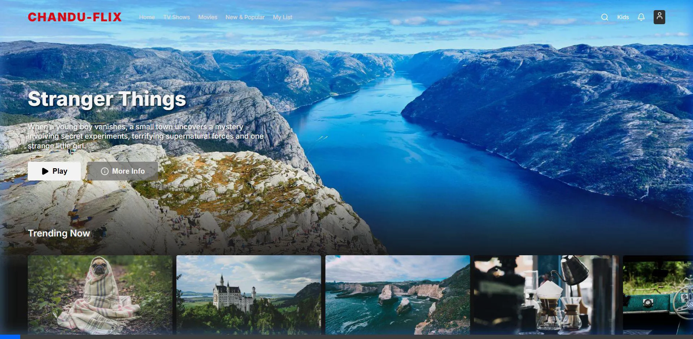

# Chandu-Flix

A premium, responsive Netflix clone built with React, Vite, and CSS.

## Features

- **Dark Mode UI:** Sleek, modern dark mode interface inspired by Netflix.
- **Dynamic Navbar:** Transparent navbar that transitions to solid black on scroll.
- **Interactive Rows:** Horizontally scrollable category rows featuring smooth hover animations.
- **Hero Banner:** Full-width featured banner with gradient overlay for text readability.

## Preview

Here is a quick preview of the interactive UI:



## Local Development

To run the project locally:

1. Install dependencies:
```bash
npm install
```

2. Start the development server:
```bash
npm run dev
```

3. Open your browser and navigate to `http://localhost:5173`.
